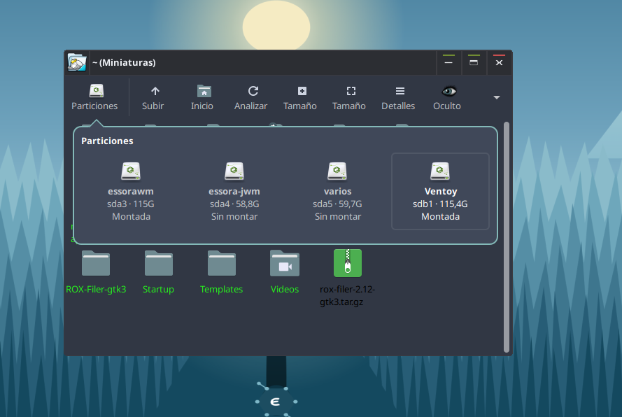

<p align="center">
  
</p>

<h1 align="center">ROX-Filer 2.12 GTK3</h1>

<p align="center">
  A fast and lightweight GTK3 file manager and desktop for Puppy Linux,
  Essora and other lightweight X11/XLibre environments.
</p>

<p align="center">
  Classic ROX-Filer simplicity, modern GTK3 integration and an optional desktop mode.
</p>

---

<p align="center">
  
</p>

## Overview

ROX-Filer is a fast and lightweight graphical file manager originally created
by **Thomas Leonard** for the ROX Desktop.

This repository contains an ongoing GTK3 development line based on the
**ROX-Filer 2.11 source used by Puppy Linux Woof-CE**.

The **2.12 GTK3** name identifies this maintained fork. It does not refer to a
separate upstream ROX-Filer 2.12 release.

The project preserves the traditional ROX-Filer workflow while modernising the
GTK2-era implementation and adding practical desktop features for current Puppy
Linux, EssoraPup and Essora systems.

The primary targets are:

- Puppy Linux
- EssoraPup
- Essora
- JWM
- EssoraWM
- Other lightweight X11 and XLibre environments

> ROX-Filer GTK3 currently targets X11/XLibre. It is not yet a native Wayland
> desktop or file manager.

## Project goals

- Preserve the classic ROX-Filer workflow.
- Keep startup fast and resource use low.
- Remove the normal runtime dependency on GTK2.
- Integrate correctly with GTK3 widget and icon themes.
- Use XDG and Freedesktop standards where practical.
- Improve behaviour on Puppy Linux, EssoraPup and Essora.
- Keep the source understandable and maintainable.
- Preserve original copyright and contributor notices.
- Add useful desktop features without turning ROX-Filer into a heavy desktop
  environment.

## Main capabilities

- GTK3 file-manager interface.
- Classic ROX-Filer icon and detailed list views.
- Native ROX File Search companion application.
- Optional paired filer windows.
- Optional directory-only single-click navigation.
- Optional ROX Desktop mode.
- Files and launchers from `~/Desktop`.
- Wallpaper and desktop-application managers.
- Correct device icons for internal, removable, optical and flash storage.
- Configurable desktop drive layout.
- Standard Freedesktop Trash.
- XDG application associations.
- Standard GTK icon-theme integration.
- Faster rsync-assisted copy and move operations.
- Improved copy, move and permanent-delete progress dialogs.
- Multiple desktop-item selection and movement.
- Built-in file templates.
- Centred normal windows and dialogs.
- Classic ROX pinboard and panel compatibility.
- Debian and portable package generation.
- Standard `/usr/bin/ROX-Filer` launcher.

## Quick start

Build ROX-Filer:

```sh
cd ROX-Filer
./AppRun --compile
```

Run a separate file-manager instance:

```sh
./AppRun -n
```

Start ROX Desktop:

```sh
ROX-Filer --desktop
```

Open the wallpaper manager:

```sh
ROX-Filer --desktop-wallpaper
```

Open the desktop application manager:

```sh
ROX-Filer --desktop-apps
```

Refresh an already-running ROX Desktop:

```sh
ROX-Filer --desktop-refresh
```

Open ROX File Search in the current directory:

```sh
rox-find .
```

Open two paired filer windows after enabling the feature in Options:

```sh
ROX-Filer --pair /root /mnt/sdb1
```

## Current GTK3 status

The project builds against:

```text
GTK+ 3.22 or newer
```

The normal build uses GTK3 and no longer requires GTK2.

The GTK3 port includes:

- GTK3 widgets and containers.
- GTK3 event handling.
- Cairo-based custom drawing where still required.
- `GtkStyleContext` integration.
- GTK3-compatible menus and toolbars.
- GTK3-compatible scrolling and file views.
- GTK3-compatible drag and drop.
- GTK3 preferences and dialogs.
- GTK3 icon-theme loading.
- Native GTK3 About dialog.
- Replacement of removed GTK2 menu infrastructure.
- X11/XLibre integration through GDK X11 and Xlib.

Some historical compatibility code and deprecated-but-still-supported GTK2 APIs
may remain. They can be cleaned up gradually without introducing a GTK2
dependency.

# File manager

## Main file-manager features

- Fast and lightweight graphical file manager.
- Classic ROX-Filer icon and detailed list views.
- Folders-first ordering.
- Complete non-hidden directory contents.
- Drag and drop.
- AppDir support.
- Symbolic-link handling.
- Extended-attribute support.
- Per-directory display settings.
- Configurable toolbar.
- Per-window Back and Forward history.
- Permanent Partitions button.
- Mount, unmount, eject and open support.
- Fast rsync-assisted copy and move operations.
- Standard Freedesktop Trash through GIO.
- Separate permanent deletion.
- XDG default-application handling.
- Standard GTK3 widget and icon themes.
- Multilingual interface.
- Integrated terminal actions.
- Built-in file templates.
- Native GTK3 About dialog.

## Window defaults

New filer windows use an initial size of:

```text
640 × 400 pixels
```

The size is applied after the initial GTK mapping so the content layout cannot
stretch a new window into a single wide row.

A saved per-directory geometry still takes priority. Older saved sizes are
clamped so a normal filer window cannot open below 640 × 400 pixels.

The window remains fully resizable.

## Centred and square dialogs

Normal ROX-Filer dialogs are centred using the usable monitor area rather than
the complete screen rectangle.

This includes:

- Rename
- Delete
- Permanent delete
- Properties
- Create directory
- Create symbolic link
- Preferences
- Bulk rename
- Icon editing
- Confirmation dialogs
- Wallpaper and desktop-management windows

The usable-area calculation takes the desktop panel into account so dialog
buttons are not hidden behind it.

Menus and normal dialogs use square corners. This avoids black corner artefacts
that may appear with rounded popup windows on XLibre, systems without a
compositor or themes that use transparent rounded surfaces.

GTK3 still controls colours, text, selection, spacing, typography and icons.

## Preferences window

The Preferences window uses a default size of:

```text
640 × 400 pixels
```

Large pages are placed inside scrollable GTK3 containers. The category list
also uses its own compact scrollable panel.

Old ROX-specific colour controls were removed. File-view colours come from the
active GTK3 theme.

## Modern Options window

The Options window is organised around the current GTK3 feature set:

- General
- Navigation and Clicks
- View
- Thumbnails
- Paired Windows
- Search
- File Operations
- Toolbar
- Desktop
- Classic Compatibility

Obsolete GTK2 theme controls and the old `Choices/MIME-types` association
interface are not exposed. GTK appearance comes from the active GTK3 settings,
and default applications come from XDG/GIO.

The **Classic Compatibility** page keeps older ROX features available without
mixing them into the normal workflow. The legacy `SendTo` directory menu is
disabled by default and can be enabled there when required by older Puppy
applications.

## Single-click directory mode

The Navigation and Clicks page can enable:

```text
Open directories with a single click
```

In this mode normal directories open with one click, while regular files and
AppDirs continue to require a double click. The historical global single-click
mode remains available separately.

## Back and Forward navigation

Each filer window keeps its own lightweight directory history.

```text
Alt+Left   Back
Alt+Right  Forward
```

Opening a new directory after navigating backwards clears the Forward branch.
History is limited to 100 paths per window.

## Complete directory contents

The normal filer view displays every non-hidden item in the current directory.

Folders are placed first. Other files follow in stable name order.

Historical type filters, saved glob filters and directories-only/files-only
states are not applied to the normal view. This prevents archives, AppImages,
scripts and other regular files from appearing to be missing.

At the end of a scan, ROX-Filer compares the visible collection with the
directory's internal item table. If an item is missing, duplicated or stale, the
view is rebuilt and the GTK3 layout is recalculated.

Hidden files remain controlled by the **Hidden** toolbar action.

## Permanent Partitions button

The main toolbar includes a permanent **Partitions** button.

It is outside the configurable toolbar-item list and cannot be removed from the
toolbar preferences.

The partition view combines information from:

- `lsblk`
- Puppy runtime entries under `/tmp/pup_event_frontend/drive_*`
- Real partitions under `/sys/class/block/*/partition`

Technical devices are filtered, including:

- Loop devices
- ZRAM and RAM devices
- Device-mapper helper devices
- Puppy runtime layers
- SquashFS, overlay and AUFS layers
- Swap volumes
- EFI system partitions

ROX-Filer first requests the complete modern `lsblk` column set and retries with
a smaller compatible set when older Puppy Linux versions do not provide every
column.

Mounted devices open directly.

Unmounted devices are mounted before opening:

- Puppy/root sessions use `/bin/mount` under `/mnt/<device>`.
- Normal-user sessions may use `udisksctl mount -b`.

Right-clicking a partition provides:

- Open
- Mount
- Unmount
- Eject

Removable media can be unmounted and safely powered off with `udisksctl`, with
`eject` as a fallback.

<p align="center">
  
</p>

## Correct device icons

ROX-Filer identifies the real device type before requesting an icon from the
active icon theme.

Examples include:

```text
drive-harddisk
drive-harddisk-solidstate
drive-removable-media
media-flash
media-cdrw
drive-network
media-floppy
```

Recognised devices include:

- Internal hard drives
- SSD and NVMe drives
- USB flash drives
- SD and MMC cards
- Optical devices such as `sr0`
- Floppy devices
- Network drives

ROX-Filer does not scan unrelated installed icon themes and does not force
GNOME icon files. GTK3 resolves the semantic icon name through the active icon
theme configured by the user.

## Fast rsync copy and move engine

ROX-Filer GTK3 includes a hybrid file-operation engine for faster local copies.

The historical engine started an external `cp` process for each regular file.
That is reliable but slow for directories containing hundreds or thousands of
small files.

When `rsync` is available, the project can use:

- One rsync process for a complete directory tree.
- One rsync batch for compatible multiple selections.
- `rename()` or `mv` for moves on the same filesystem.
- `rsync --remove-source-files` for cross-filesystem moves and directory merges.
- `--partial` to preserve incomplete transfer data after interruption.

ROX-Filer never adds `--delete` to normal copy or move operations, so unrelated
destination files are not removed.

When `rsync` is unavailable, ROX-Filer falls back to the classic copy and move
engine.

### Conflict policy

When destination items already exist, one conflict-policy dialog is shown.

Available choices:

- Ask for each conflict.
- Replace existing files.
- Skip existing files.
- Replace only when the source is newer.

**Ask for each conflict** is the safe default.

The comparison dialog can apply one Replace or Skip choice to all remaining
conflicts in the current operation.

The selected policy is reset before the next copy or move.

## Improved operation dialogs

Copy, move and permanent-delete operations use clearer GTK3 progress windows.

The interface can show:

- The current operation.
- Source and destination information.
- Visual progress.
- Error details when needed.
- Cancel and decision controls.

The dialogs keep a compact ROX-style workflow while presenting progress in a
form familiar to users of current graphical file managers.

The child-process communication handles pending input correctly when GLib
reports data and pipe closure at the same time. Successful operations close
their progress window automatically.

## Standard Trash

The normal **Delete** key moves selected items to the standard Freedesktop
Trash.

ROX-Filer uses GIO so each filesystem can select the correct Trash location and
write the metadata required for restoring files.

The standard user Trash is normally:

```text
~/.local/share/Trash/files
~/.local/share/Trash/info
```

Available actions include:

- Open Trash
- Move selected items to Trash
- Restore selected items
- Empty Trash
- Permanently delete with `Shift+Delete`

The Trash is available:

- In the filer toolbar.
- In contextual menus.
- As an optional desktop icon.

Filesystems without Trash support show an error. ROX-Filer does not silently
convert a failed Trash operation into permanent deletion.

Permanent deletion remains a separate operation and asks once for the complete
selection.

## XDG file associations

ROX-Filer uses the standard XDG/GIO application-association system.

The primary user configuration is:

```text
~/.config/mimeapps.list
```

Applications selected as default in another XDG-compatible file manager, such
as Thunar or PCManFM, can therefore also be recognised by ROX-Filer.

The old ROX-specific association directories are no longer used to decide the
default application:

```text
~/Choices/MIME-types
~/.config/rox.sourceforge.net/MIME-types
```

The **Set Default Application** action uses GIO to store the standard default
application for the selected MIME type.

## Standard MIME icons

ROX-Filer requests standard MIME icon names from the active icon theme.

Puppy-specific MIME icons can be installed into the standard `hicolor` theme:

```text
application-pet
application-x-sfs
application-x-squashfs-image
```

The Debian package can install them under:

```text
/usr/share/icons/hicolor/16x16/mimetypes
/usr/share/icons/hicolor/24x24/mimetypes
/usr/share/icons/hicolor/48x48/mimetypes
/usr/share/icons/hicolor/scalable/mimetypes
```

The post-installation script creates missing `mimetypes` directories and
refreshes the icon cache when `gtk-update-icon-cache` is available.

This makes the icons available to ROX-Filer and other applications that follow
the Freedesktop icon-theme standard.

## GTK3 theme integration

GTK3 reads the user's theme configuration from:

```text
~/.config/gtk-3.0/settings.ini
```

For example:

```ini
[Settings]
gtk-theme-name=YourGtkTheme
gtk-icon-theme-name=YourIconTheme
gtk-font-name=Sans 10
```

ROX-Filer does not force fixed file-view background or text colours.

The active GTK3 theme controls:

- File-view background
- Normal text
- Selected text
- Selection background
- Disabled controls
- Menus
- Dialogs
- Toolbar buttons
- Fonts and spacing

## System icon theme

ROX-Filer uses standard semantic icon names for:

- Toolbar actions
- Folders
- Applications
- AppDirs
- List view
- Selection actions
- Devices
- Unmount and eject actions
- Symbolic links
- Extended attributes
- Terminal actions
- Wallpaper management
- Desktop application management
- Trash

Examples include:

```text
folder
application-x-executable
view-list
edit-select-all
drive-harddisk
drive-removable-media
media-eject
document-properties
emblem-symbolic-link
utilities-terminal
preferences-desktop-wallpaper
applications-other
user-trash
user-trash-full
```

The bundled `ROX-Filer/images/rox-show-hidden.png` image is used only when the
active theme does not provide a supported Hidden-action icon.

## Thumbnail cache

Image thumbnails are generated in the background and stored under the standard
Freedesktop cache location:

```text
~/.cache/thumbnails/normal
```

The Options window includes a cache-purge action. Until a thumbnail is ready,
ROX-Filer continues to display the normal MIME icon. Broken symbolic links are
not hidden from normal filer views.

## Terminal integration

When a directory is selected, the contextual menu provides:

```text
Open Terminal Here
```

For supported executable files, it provides:

```text
Run in Terminal
```

Supported files include:

- Native executable binaries
- Executable shell scripts
- `.sh` files
- `.py` files
- `.pyw` files
- Executable AppImages
- Files with a valid interpreter line

Arguments are safely separated and paths containing spaces are supported.

The configured terminal is controlled by ROX-Filer's existing:

```text
menu_xterm
```

option.

The standard icon is:

```text
utilities-terminal
```

## ROX File Search

The project includes a separate native C/GTK3 companion application:

```text
/usr/bin/rox-find
```

Its visible application name is **ROX File Search**. It follows the active GTK3
theme and uses the supplied `rox-find` application icon. Because it runs as a
separate process, normal ROX-Filer instances do not carry the search engine in
memory.

Search can be started from:

- the contextual menu of the current directory;
- one selected directory;
- several selected directories;
- the optional Search toolbar button;
- the application menu through `rox-find.desktop`;
- the command line.

Examples:

```sh
rox-find /root
rox-find /root /mnt/sdb1
rox-find --name '*.svg' /usr/share
rox-find --content 'ROX-Filer' --max-content-mb=20 /root/projects
rox-find --hidden /root
```

The interface supports:

- name or glob-pattern matching;
- recursive or non-recursive search;
- hidden items;
- case-sensitive matching;
- files, directories or symbolic links;
- minimum and maximum file sizes;
- optional text-content search with a configurable maximum file size;
- optional symbolic-link traversal;
- restriction to the selected filesystem;
- cancellation while a search is running;
- progressively displayed results.

Result actions include **Open**, **Show in ROX-Filer**, **Open Parent Folder**,
**Copy Path** and **Move to Trash**. `Show in ROX-Filer` opens the containing
directory and selects the result through the standard `ROX-Filer -s` command.

The desktop entry is installed as:

```text
/usr/share/applications/rox-find.desktop
```

The main application icon is installed as `rox-find` in `hicolor` and under
`/usr/share/pixmaps`.

## Paired windows

ROX-Filer can place two normal filer windows side by side or one above the
other without external tools such as `wmctrl`, `xprop`, `xwininfo` or Xdialog.

Enable **Paired Windows** in Options, then use the Window menu, optional toolbar
button or command line:

```sh
ROX-Filer --pair
ROX-Filer --pair /root /mnt/sdb1
ROX-Filer --pair-realign
```

The feature supports:

- left/right and top/bottom layouts;
- configurable split percentage and gap;
- the usable monitor work area;
- keeping both windows on the same monitor;
- Home, same, last-used or custom second directories;
- remembered paired directories;
- manual realignment after monitor or panel changes.

Each side remains a normal ROX-Filer window with its own Back/Forward history,
view settings, selection and drag-and-drop behaviour.

## New menu and built-in templates

The toolbar and context menu include a **New** submenu.

It can create:

- A directory
- A blank file
- A shell script
- A text file
- A web page
- A Python file
- User-defined templates

Bundled templates are stored in:

```text
ROX-Filer/Templates/
```

User templates can be stored in:

```text
~/.config/rox.sourceforge.net/Templates/
```

When a user template and a bundled template have the same name, the user
template takes priority.

# ROX Desktop

## Starting the desktop

Start ROX Desktop with:

```sh
ROX-Filer --desktop
```

This mode manages:

- Wallpaper
- Files and launchers from `~/Desktop`
- Drive and partition icons
- Desktop icon positions
- Standard Trash
- Desktop contextual menus
- Desktop refresh operations

The `/usr/bin/ROX-Filer` launcher provides a standard executable path for this
mode and for the normal filer.

### Refreshing a running desktop

```sh
ROX-Filer --desktop-refresh
```

This command does not start another desktop. It sends a request to the existing
X11/XLibre ROX Desktop process and refreshes files from `~/Desktop`, Trash,
devices, the usable work area and icon placement.

## Desktop files and applications

The new desktop always uses:

```text
~/Desktop
```

It does not create or switch to translated directory names such as
`~/Escritorio`.

Files, folders and `.desktop` launchers placed in `~/Desktop` appear on the
desktop.

Supported interactions include:

- Double-click to launch or open.
- Drag to move an icon.
- Persistent manual positions.
- Multiple selection with `Ctrl`, `Shift` or `Ctrl+Alt`.
- Group movement of selected icons.
- Delete to move selected items to Trash.
- Enter to open selected items.
- Contextual actions for one or multiple items.

Positions are stored in:

```text
~/.config/rox.sourceforge.net/ROX-Filer/desktop-positions.conf
```

Desktop preferences are stored in:

```text
~/.config/rox.sourceforge.net/ROX-Filer/desktop.conf
```

## Desktop application manager

Open the application manager with:

```sh
ROX-Filer --desktop-apps
```

The manager allows applications to be added to or removed from `~/Desktop`.

A menu entry can use:

```ini
Exec=ROX-Filer --desktop-apps
Icon=applications-other
```

## Wallpaper manager

Open the wallpaper manager with:

```sh
ROX-Filer --desktop-wallpaper
```

The manager supports:

- Browsing `/usr/share/backgrounds`.
- Choosing another image.
- Wallpaper fill styles.
- Applying several wallpapers without closing the selector.
- Refreshing the desktop after the wallpaper changes.
- Restart-aware refresh for wbar and desktop work-area changes.

A menu entry can use:

```ini
Exec=ROX-Filer --desktop-wallpaper
Icon=preferences-desktop-wallpaper
```

The selector remains open after **Apply**, allowing the user to continue testing
different wallpapers.

## Desktop drive icons

Drive icons are displayed independently from the classic PuppyPin.

The desktop can show or hide:

- Internal drives
- Removable drives
- Network drives
- Labels
- Label frames
- Quick unmount buttons

Layout controls include:

- Horizontal or vertical orientation
- Left, centre or right position
- Top, centre or bottom position
- Icon size
- Horizontal spacing
- Vertical spacing
- Horizontal offset
- Vertical offset
- Reverse order

A typical EssoraWM-compatible layout is:

```ini
[Main]
desktop_drive_icons=true
desktop_drive_show_internal=true
desktop_drive_show_removable=true
desktop_drive_show_network=false
desktop_drive_icon_size=32
ShowLabels=true
ShowFrame=false
Vertical=false
ReversePack=true
SpacingX=87
SpacingY=87
XOffset=20
YOffset=-40
XPos=0.0
YPos=1.0
```

`XOffset` and `YOffset` move the complete drive group by small increments.

The **Realign Drive Icons** action reapplies the configured layout and reserved
desktop area.

ROX-Filer refreshes drive placement:

- During desktop startup.
- After wallpaper changes.
- After wbar restarts.
- When the usable monitor work area changes.
- When devices are added or removed.

Desktop application icons and drive icons use collision-aware placement so they
do not overlap.

## Desktop Trash

ROX Desktop can display a standard Trash icon.

The contextual menu provides:

- Open Trash
- Restore Items
- Empty Trash

The icon changes between the active theme's empty and full Trash states when
supported:

```text
user-trash
user-trash-full
```

## Desktop text

Desktop labels use transparent backgrounds.

Normal labels use high-contrast text and a subtle shadow so they remain readable
on light and dark wallpapers without drawing a solid rectangle behind every
name.

Selected desktop items use the active GTK3 selection colours.

## Classic PuppyPin compatibility

ROX Desktop does not use:

```text
/root/Choices/ROX-Filer/PuppyPin
```

The old pinboard remains available through the classic ROX command-line options,
including:

```sh
ROX-Filer -p PINBOARD
```

Classic panel support also remains available.

Users who run only:

```sh
ROX-Filer --desktop
```

do not need to modify PuppyPin.


# Command-line interface

Important desktop commands:

```text
ROX-Filer --desktop
ROX-Filer --desktop-wallpaper
ROX-Filer --desktop-apps
ROX-Filer --desktop-refresh
ROX-Filer --pair [LEFT [RIGHT]]
ROX-Filer --pair-realign
rox-find [OPTIONS] [FOLDER…]
```

Important file-manager options:

```text
-c, --client-id=ID
-d, --dir=DIR
-D, --close=DIR
-h, --help
-m, --mime-type=FILE
-n, --new
-R, --RPC
-s, --show=FILE
-u, --user
-U, --url=URL
-v, --version
-x, --examine=FILE
```

Classic compatibility options:

```text
-b, --border=PANEL
-B, --bottom=PANEL
-l, --left=PANEL
-p, --pinboard=PIN
-r, --right=PANEL
-S, --rox-session
-t, --top=PANEL
```

# Build and packaging

## Build requirements

A C development environment and development files are required for:

- GTK+ 3.22 or newer
- GLib and GObject
- GDK-Pixbuf
- Cairo
- libxml2
- X11
- X Session Management (`sm`)
- Inter-Client Exchange (`ice`)
- `pkg-config`
- GNU Autoconf tools when regenerating `configure`

The exact package names depend on the distribution.

The main dependency check is equivalent to:

```sh
pkg-config --cflags --libs gtk+-3.0 libxml-2.0 sm ice
```

## Optional runtime tools

- `rsync` enables fast directory and batch-copy operations.
- A configured terminal emulator is used by terminal actions.
- `python3` is used for Python terminal actions and the bundled Python template.
- `udisksctl` can mount, unmount and power off devices in normal-user sessions.
- `gtk-update-icon-cache` refreshes the `hicolor` cache after package
  installation.

## Build and create packages

From the repository root:

```sh
cd ROX-Filer
./AppRun --compile
```

The build process can:

1. Compile ROX-Filer.
2. Compile ROX File Search.
3. Update and include translations.
4. Create the complete package tree.
5. Remove `build` and `src` from the final runtime package.
6. Create a Debian package.
7. Preserve a complete Debian package directory.
8. Create a portable `usr/` tree.
9. Create a portable `tar.gz` archive.
10. Remove the temporary build directory.

Generated names use the current project version and architecture. A typical
output layout is:

```text
output/
├── rox-filer_<version>_<architecture>.deb
├── rox-filer_<version>_<architecture>/
├── rox-filer-<version>-portable-<architecture>/
└── rox-filer-<version>-portable-<architecture>.tar.gz
```

The Debian package directory contains the complete package control and runtime
tree.

The portable directory contains the runtime `usr/` tree and can be used as a
base for:

- PET
- TXZ
- Slackware packages
- Arch-style packages
- Other distribution-specific formats

## Build without packaging

```sh
./ROX-Filer/AppRun --compile-only
```

## Package an existing binary

```sh
./build-package.sh --skip-compile
```

## Clean generated files

```sh
./build-package.sh --clean
```

## Clean rebuild

```sh
cd ROX-Filer

rm -rf build
rm -f ROX-Filer ROX-Filer.dbg

./AppRun --compile
./AppRun -n
```

Close an older process before testing a new binary:

```sh
killall ROX-Filer 2>/dev/null
./AppRun -n
```

## Debian maintenance scripts

The source includes Debian maintenance scripts for installing and removing the
Puppy MIME icons.

The post-installation script:

- Creates missing `hicolor/*/mimetypes` directories.
- Installs PET, SFS and SquashFS MIME icons.
- Applies mode `0644`.
- Refreshes the icon cache when possible.

The post-removal script removes the installed package-owned MIME icons and
refreshes the cache.

# Repository layout

Important files and directories include:

```text
.
├── README.md
├── CHANGELOG
├── LICENSE
├── ROX-Filer.svg
├── build-package.sh
├── DEBIAN/
│   ├── postinst
│   └── postrm
├── package-base/
├── rox-find/
│   ├── rox-find.c
│   ├── Makefile
│   ├── data/
│   ├── locale/
│   └── po/
├── screenshot/
│   ├── rox-desktop-demo-slow.gif
│   └── rox-particiones.png
├── ROX-Filer/
│   ├── AppRun
│   ├── AppInfo.xml
│   ├── Options.xml
│   ├── Templates.ui
│   ├── Templates/
│   │   ├── Script
│   │   ├── Text.txt
│   │   ├── WebPage.html
│   │   └── python3.py
│   ├── ROX/
│   │   └── MIME/
│   │       ├── application-pet.svg
│   │       ├── application-x-sfs.svg
│   │       └── application-x-squashfs-image.svg
│   ├── images/
│   ├── Messages/
│   ├── Help/
│   └── src/
└── .gitignore
```

The exact layout may evolve as development continues.

# Configuration

ROX-Filer configuration is stored under:

```text
~/.config/rox.sourceforge.net/ROX-Filer/
```

Important files include:

```text
Options
Settings.xml
desktop.conf
desktop-positions.conf
```

Other relevant standards-based locations include:

```text
~/.config/mimeapps.list
~/.config/gtk-3.0/settings.ini
~/.local/share/Trash/
~/.cache/thumbnails/normal/
~/Desktop
```

# Interface languages

Included interface languages include:

- English
- Arabic
- Catalan
- German
- Spanish
- French
- Italian
- Portuguese
- Japanese
- Hungarian
- Russian
- Simplified Chinese
- Traditional Chinese

The original upstream catalogues are preserved and updated catalogues are
included for the GTK3 additions.

ROX File Search includes its own catalogues for Arabic, Catalan, German,
Spanish, French, Hungarian, Italian, Japanese, Portuguese, Russian, Simplified
Chinese and Traditional Chinese.

Precompiled `.mo` files are included so translations can work on systems where
`msgfmt` is unavailable.

ROX-Filer binds the translation domain to:

```text
ROX-Filer/Messages/<locale>/LC_MESSAGES/ROX-Filer.mo
```

When installed under `/usr/local/apps/ROX-Filer`, the catalogues remain under:

```text
/usr/local/apps/ROX-Filer/Messages
```

# Compatibility and future backends

The primary target is GTK3 on X11/XLibre.

The source uses:

- GDK X11
- GTK X11 embedding support
- Xlib
- X Session Management
- ICE

The `--desktop` command is a stable desktop entry point.

At present it launches the X11/XLibre desktop implementation. In the future,
the same command may be able to select additional desktop backends without
changing how users start ROX Desktop.

Native Wayland support is not currently implemented.

A complete Wayland backend would require replacements for:

- The bottom desktop window layer
- Work-area detection
- Desktop icon positioning
- X11 window-property handling
- Panel and compositor integration
- Other X11-specific functions

# Known limitations

- More testing is useful across different GTK3 themes and icon themes.
- Behaviour can vary between Puppy Linux variants and window managers.
- Some deprecated-but-supported GTK3 APIs remain.
- Some historical classic pinboard and panel code remains for compatibility.
- X11/XLibre desktop and panel functionality does not work natively on Wayland.
- Optional features depend on external tools such as `rsync`, `udisksctl` and a
  terminal emulator.
- Translation coverage can vary between languages.

# Reporting issues

Please include:

- Distribution and version
- Desktop or window manager
- X11 or XLibre version
- GTK3 version
- ROX-Filer revision
- Steps to reproduce
- Console output
- Relevant log files
- A screenshot for visual problems

For input or event problems:

```sh
ROX_TRACE_INPUT=1 GDK_SYNCHRONIZE=1 ./AppRun -n
```

Report issues to:

```text
puppylinuxjosejp2424@gmail.com
```

Project repository:

```text
https://github.com/josejp2424/ROX-Filer-gtk3
```

# Contributing

Contributions, tests and translations are welcome.

Changes should:

- Preserve the lightweight character of ROX-Filer.
- Remain compatible with GTK3.
- Avoid unnecessary dependencies.
- Preserve original copyright notices.
- Follow the existing source style where practical.
- Be tested on X11 or XLibre.
- Include translation updates for new interface strings when possible.

# Changelog and releases

Development changes are recorded in:

```text
CHANGELOG
```

Release-specific announcements, screenshots and package names should be kept in
GitHub Releases, forum posts or changelog entries rather than permanently
describing one revision in this README.

When a new revision is published, normally only these items need review:

- The visible version in `AppInfo.xml` and the About dialog.
- Package metadata.
- `CHANGELOG`.
- Build output naming.
- Features that were added, removed or changed.
- Known limitations.

# Credits

## Original project

ROX-Filer was originally created by **Thomas Leonard** for the ROX Desktop.

The project includes work from the original ROX Desktop contributors. Original
copyright and attribution notices remain preserved in the source.

## GTK3 version

- GTK3 port: **josejp2424**
- New GTK3 integration and features: **josejp2424**
- ROX Desktop implementation: **josejp2424**
- Maintainer of this version: **josejp2424**

# License

This modified GTK3 version is distributed under:

```text
GNU General Public License, version 3 or, at your option, any later version
```

SPDX identifier:

```text
GPL-3.0-or-later
```

See:

```text
LICENSE
```

The original ROX-Filer source was distributed under GPL-2.0-or-later. That
licensing permits this modified version to be distributed under
GPL-3.0-or-later.

All original copyright, authorship and licensing notices are retained.

Files containing third-party code may retain their own compatible copyright and
license notices. Those file-specific notices remain applicable.

---

<p align="center">
  <strong>ROX-Filer 2.12 GTK3</strong><br>
  Classic ROX-Filer simplicity, adapted for modern GTK3 desktops.
</p>
